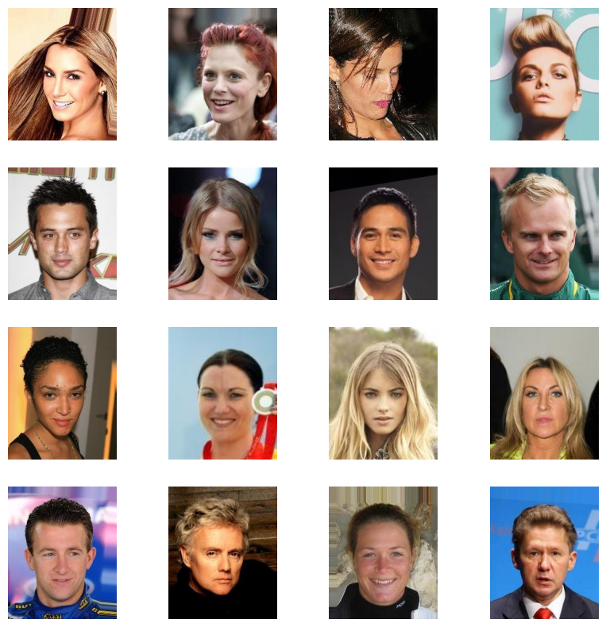
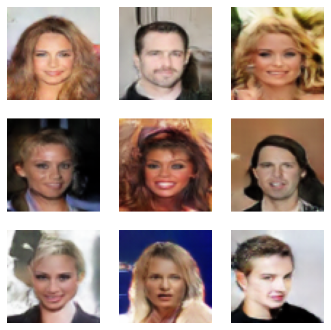

# GAN-face-gen with DCGAN

With reference from : [DCGAN Paper](https://arxiv.org/pdf/1511.06434.pdf)

Dataset : CelebFaces Attributes Dataset (CelebA)

### Code : [Notebook](./notebooks/face-DCGAN.ipynb)
---
### Results

